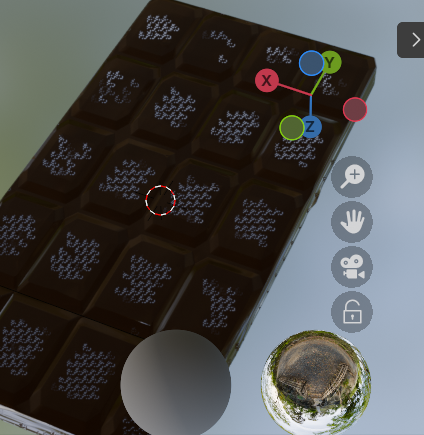
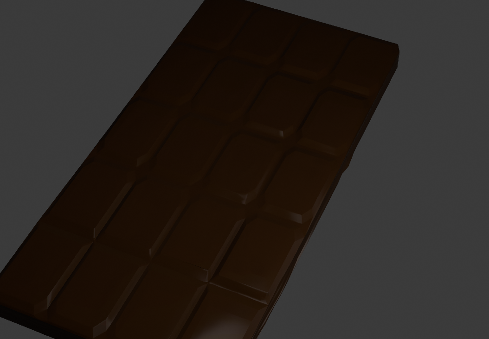

# CHOCOLATE WEBSITE
### IN THE MAKING
trying to make a 3d eccomernce chocolate website (IDK WHY I AM DOING THIS TO MYSELF)
This readme is a progress report and a rant just to show the process start to finish (IM FAILING AND I HATTTTEEE BLENDER)
1. My laptop wasn't made for anything 3d bro is literally heathing 
2. I'M NOT GOOD AT BLENDER so this is taking an awfully long time
3. my mouse keeps dying idk why but i have to replug it every 5 minutes 

now for some photos
## Heres the first chocolate model

Is it the best? No
Is it alright? Yes, It works for now 

## Now idk why in shading it does this but the render looks decent-ish

# Some weird shit I wrote at like 3 AM (Excuse the grammer , puctuation, spelling , overall meaning of the text)

I'm bound to my laptops capabilities, all I want is to make a filling but it won't allow me it's failing, dying, taking it's final breath as I'm trying to zoom out . It knows that I'm not done I'm mearly giving it a break it prays to it's god hoping to be saving from my constant deathly clicks but no one shall answer it's prayers. It's GPU wasn't made for rendering high poly animation yet I click subdivide one more time maybe it's the last time then I undo it , it wonders for what reason cruelty , hate or do I just enjoy watching it break.
